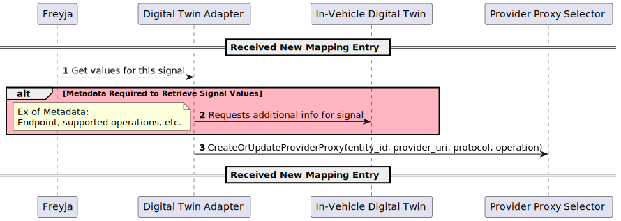

# Digital Twin Adapters

A Digital Twin Adapter communicates with the In-Vehicle Digital Twin to get signal values during emission.

A Digital Twin Adapter should implement the `DigitalTwinAdapter` trait from [contracts/DigitalTwinAdapter](../../contracts/src/digital_twin_adapter.rs).

## General Behavior

The sequence diagram below illustrates the general behavior of a Digital Twin Adapter after receiving a new mapping entry of a signal.

Please see [the design document](../../docs/design/README.md) for how Freyja retrieves a new mapping entry.

.

Please see [the Provider Proxy Selector document](../../provider_proxy_selector/) for how a Provider Proxy Selector creates a provider proxy for retrieving signal values.

## Sample Digital Twin Adapters

This directory contains sample implementations of the `DigitalTwinAdapter` trait from [contracts]
