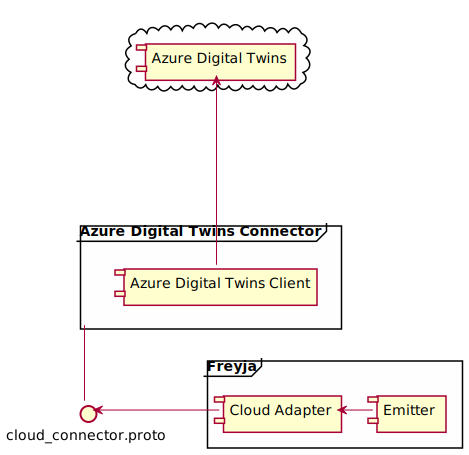

# Azure Digital Twins Cloud Connector

This is an example implementation of an Azure Cloud Connector.

Freyja is not tightly coupled with Azure and can synchronize data with any cloud solution, provided an appropriate Cloud Connector and adapter are written.

## Architecture

The Azure Digital Twins Cloud Connector updates an Azure Digital Twin instance directly with the data emitted by Freyja.

Below is a high-level diagram that illustrates Freyja communicating with the Azure Digital Twins Cloud Connector.



## Prerequisites

### .NET 6.0 Setup

Install .NET 6.0

```shell
sudo apt install dotnet-sdk-6.0
```

### Automated Azure Digital Twins Setup<a name="automated azure digital twins setup"></a>

You must first have these installed:

* [Azure CLI](https://learn.microsoft.com/en-us/cli/azure/install-azure-cli)

* [Azure IoT CLI Extension](https://github.com/Azure/azure-iot-cli-extension)

You will need to be an Owner or a Contributor for your Azure resource group to deploy Azure resources using the `{freyja-root-dir}/cloud_connectors/azure/scripts`. Please see [Azure built-in roles](https://learn.microsoft.com/en-us/azure/role-based-access-control/built-in-roles) for more details.

1. Sign in with Azure CLI. Follow the prompts after entering the following command.

```shell
az login --use-device-code
```

1. Deploy Azure Digital Twins to your resource group.

```shell
cd {freyja-root-dir}/cloud_connectors/azure/scripts
chmod +x digital_twins_setup.sh
./digital_twins_setup.sh --resource-group {YOUR_RESOURCE_GROUP} --location westus2
```

### Troubleshooting

If at any point you run into permission or deployment errors, try running the script again. The script will not create additional copies of Azure Digital Twins if you use the same Azure Digital Twins name.

Additionally, you may follow the section below for manually deploying the Azure Digital Twins resource.

### Manual Azure Digital Twins Setup

If you have successfully ran the `digital_twins_setup.sh`, you do not need to follow this section.

The steps below will guide you on manually deploying the Azure Digital Twins resource to your resource group, and creating your Azure Digital Twins instances.

1. Set up your [Azure Digital Twin Instance](https://learn.microsoft.com/en-us/azure/digital-twins/quickstart-azure-digital-twins-explorer#set-up-azure-digital-twins).

    If you wish to use the default mappings in `{repo-root-dir}/mapping_clients/in_memory_mock_mapping_client/res/config.json` and `{repo-root-dir}/mocks/mock_mapping_service/res/config.json`, create the following instances:

    * vehicle
    * hvac
    * obd

    For each instance, use the respective DTDL provided in `{repo-root-dir}/cloud_connector/azure/sample-dtdl`.

    In your hvac instance, name the two properties as AmbientAirTemperature and IsAirConditioningActive.

    In your obd instance, name the single property as HybridBatteryRemaining.

1. Follow the *Open instance in Azure Digital Twins Explorer* section under [Set up Azure Digital Twins](https://learn.microsoft.com/en-us/azure/digital-twins/quickstart-azure-digital-twins-explorer#set-up-azure-digital-twins) to get the Azure Digital Twin URL of your Azure Digital Twin instance.

1. After [building](#build) the Digital Twins Connector, you should see an `adt_instance_config.json` file in your `src/core/bin/Debug/net6.0/config` directory. If you do not see the `adt_instance_config.json` file in `src/core/bin/Debug/net6.0/config`, you can create one manually by copying the `src/core/adt_instance_config.json` file and pasting it into the `src/core/bin/Debug/net6.0/config` directory.

1. Replace the `AzureDigitalTwinsInstanceUrl` field in `src/core/bin/net6.0/config/adt_instance_config.json` with the URL to your Azure Digital Twin instance that you have obtained in step 2.

1. Ensure that you have [Azure CLI](https://learn.microsoft.com/en-us/cli/azure/install-azure-cli) installed.

1. Acquire the access token that's scoped to the Azure Digital Twin service.

```shell
az login --use-device-code --scope https://digitaltwins.azure.net/.default
```

## Configuration

The URL for the Cloud Connector's GRPC server can be configured via the `src/Properties/launchSetting.json`.

* `applicationUrl`: specifies the url to use for the Cloud Connector's GRPC server.

## Build

```shell
chmod +x build.sh
./build.sh
```

## Tests

```shell
dotnet test tests/**/*.csproj
```

## Run

The first gRPC client call to the Digital Twins Connector's gRPC server could be delayed, since the initial API call to the Azure Digital Twins service requires authentication.

```shell
dotnet run --project src/core/
```
