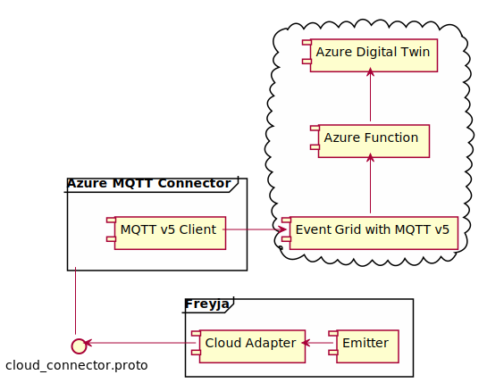

# Azure MQTT Cloud Connector

This is an example implementation of an Azure Cloud Connector.

Freyja is not tightly coupled with Azure and can synchronize data with any cloud solution, provided an appropriate Cloud Connector and adapter are written.

In this Azure MQTT Cloud Connector example, you will need to have access to Azure. You will be deploying an Azure Event Grid with MQTT v5, and Azure Function App.

## Architecture

When signals are propagated from Freyja, the Azure MQTT Cloud Connector will publish these signals to an Azure Event Grid topic using the MQTT protocol. When signals are published to a topic, an Azure Function gets triggered and updates an Azure Digital Twin instance with the data emitted by Freyja.

Below is a high-level diagram that illustrates Freyja communicating with the Azure MQTT Cloud Connector.



## Prerequisites

### Azure Digital Twins Deployed

Please see [Automated Azure Digital Twins Setup](../digital_twins_connector/README.md) or [Manual Azure Digital Twins Setup](../digital_twins_connector/README.md) for additional info on setting up Azure Digital Twins.

### Self-Signed X.509 certificate

A generated X.509 self-signed certificate and its DER format thumbprint. Please see steps 1-3 in [Azure Event Grid with MQTT](#azure-event-grid-with-mqtt) for additional info on generating an X.509 self-signed certificate.

## Automated Deployment of Azure Key Vault, Event Grid, and Azure Function App

You must install have the [Azure CLI](https://learn.microsoft.com/en-us/cli/azure/install-azure-cli) installed, and the [Azure IoT CLI Extension](https://github.com/Azure/azure-iot-cli-extension).

You will need at least the Owner or Contributor RBAC for your Azure resource group to deploy Azure resources using the `{freyja-root-dir}/cloud_connectors/azure/scripts`. Please see [Azure built-in roles](https://learn.microsoft.com/en-us/azure/role-based-access-control/built-in-roles) for more details.

1. Sign in with Azure CLI. Follow the prompts after entering the following command.

```shell
az login --use-device-code
```

1. Run the `mqtt_connector_setup.sh` in the `{freyja-root-dir}/cloud_connectors/azure/scripts` directory to deploy an Azure Key Vault, Event Grid, and an Azure Function app to your resource group.

This script requires deployment of the Azure Digital Twins resource to your resource group with Digital Twins instances created that are based on the `{freyja-root-dir}/cloud_connectors/azure/sample-dtdl` DTDL models. Please see [Automated Azure Digital Twins Setup](../digital_twins_connector/README.md) or [Manual Azure Digital Twins Setup](../digital_twins_connector/README.md) for additional info on setting up Azure Digital Twins.

In addition, you must have an X.509 self-signed certificate created. To obtain the thumbprint of your X.509 self-signed certificate in DER format, then please see steps 1-3 in [Azure Event Grid with MQTT](#azure-event-grid-with-mqtt).

```shell
cd {freyja-root-dir}/cloud_connectors/azure/scripts
chmod +x mqtt_connector_setup.sh
./mqtt_connector_setup.sh --resource-group <RESOURCE_GROUP_NAME> --subscription-id <SUBSCRIPTION_ID> --digital-twins-name <DIGITAL_TWINS_RESOURCE_NAME> --cert-thumbprint <THUMBPRINT_OF_CERT_IN_DER_FORMAT>
```

The script will prompt you for input for naming each Azure resource deployed by the script.

### Troubleshooting

If at any point you run into permission or deployment errors, try running the script again as sometimes it takes a while for some dependencies to be fully deployed. If you use the same name/identifier for the script prompts, the script will not create additional copies of Azure resources.

Additionally, you may follow the section below to manually deploy the respective Azure resource that's failing to deploy by the script.

## Manual Deployment of Azure Key Vault, Event Grid, and Azure Function App

This section requires deployment of the Azure Digital Twins resource to your resource group with Digital Twins instances created that are based on the `{freyja-root-dir}/cloud_connectors/azure/sample-dtdl` DTDL models. Please see [Automated Azure Digital Twins Setup](../digital_twins_connector/README.md) or [Manual Azure Digital Twins Setup](../digital_twins_connector/README.md) for additional info on setting up Azure Digital Twins.

### Azure Key Vault

1. Follow the *Open instance in Azure Digital Twins Explorer* section under [Set up Azure Digital Twins](https://learn.microsoft.com/en-us/azure/digital-twins/quickstart-azure-digital-twins-explorer#set-up-azure-digital-twins) to get the Azure Digital Twin URL of your Azure Digital Twin instance.

1. [Create an Azure Key Vault using the Azure portal](https://learn.microsoft.com/en-us/azure/key-vault/general/quick-create-portal).

1. Create a secret with `ADT-INSTANCE-URL` as the name, and the value should be the **Azure Digital Twin URL** that you obtained in step 1.

### Azure Event Grid with MQTT

> **Note**: We will be generating a self-signed X.509 certificate using OpenSSL.

1. Create a private key. Replace the `{PrivateKeyName}` placeholder with the name you wish to use.

    ```shell
    openssl genpkey -out {PrivateKeyName}.key -algorithm RSA -pkeyopt rsa_keygen_bits:2048
    ```

1. Create a certificate signing request. Replace the placeholders with their respective values, and fill in the prompts of the certificate signing request.

    ```shell
    openssl req -new -key {PrivateKeyName}.key -out {CertificateSigningRequestName}.csr
    ```

1. Create an X.509 self-signed certificate. Replace the placeholders with their respective values.

    ```shell
    openssl x509 -req -days 365 -in {CertificateSigningRequestName}.csr -signkey {PrivateKeyName}.key -out {CertificateName}.cer
    ```

1. Get the thumbprint of your certificate in DER format. You will need the thumbprint when [creating a client](https://learn.microsoft.com/en-us/azure/event-grid/mqtt-publish-and-subscribe-portal#create-clients) for your Event Grid in step 6.

    ```shell
    openssl x509 -in {CertificateName}.cer -outform DER -out {CertificateName}.crt
    sha256sum {CertificateName}.crt | awk '{print $1}'
    rm {CertificateName}.crt
    ```

1. Follow the [Quickstart: Publish and subscribe to MQTT messages on Event Grid Namespace with Azure portal](https://learn.microsoft.com/en-us/azure/event-grid/mqtt-publish-and-subscribe-portal) guide for creating an Azure Event Grid, topic namespace, and client. You can skip the *Generate sample client certificate and thumbprint* section as we've generated a self-signed certificate in steps 1-3.

1. In the [Create clients](https://learn.microsoft.com/en-us/azure/event-grid/mqtt-publish-and-subscribe-portal#create-clients) section, use the thumbprint you obtained in step 4 for thumbprint match authentication. Also keep note of what you set for the **Client Authentication Name**. You will need it later for configuring this Cloud Connector.The [Quickstart](https://learn.microsoft.com/en-us/azure/event-grid/mqtt-publish-and-subscribe-portal) guide from above for Event Grid uses a self-signed SSL certificate, and this Cloud Connector is configured to only use a self-signed SSL certificate.

1. When you [create a topic space](https://learn.microsoft.com/en-us/azure/event-grid/mqtt-publish-and-subscribe-portal#create-topic-spaces), keep note of the **topic template** you created. You will need it later for configuring this Cloud Connector.

1. Export the MQTT hostname to your Event Grid Namespace.

    ```shell
    export "EVENT_GRID_MQTT_HOSTNAME"="{YOUR_EVENT_GRID_MQTT_HOSTNAME}"
    ```

1. Export the client authentication name obtained from step 6.

    ```shell
    export "EVENT_GRID_MQTT_CLIENT_AUTHENTICATION_NAME"="{YOUR_EVENT_GRID_MQTT_CLIENT_AUTHENTICATION_NAME}"
    ```

### Azure Function App

1. [Create an Azure Function app](https://learn.microsoft.com/en-us/azure/event-grid/custom-event-to-function#create-azure-function-app) that triggers your Azure Event Grid.

1. Replace the code in your Azure Function `run.cs` with the code in the `res/azure_function/run.cs` folder of this repo.

1. Add the following files `res/azure_function/function.json` and `res/azure_function/function.csproj` to your Azure Function.

1. Go back to your Azure Function App homepage, and click on **Configuration** on the side-panel.

1. Click on **New application setting**.

1. Set the name to `KEYVAULT_SETTINGS`, and the value to `@Microsoft.KeyVault(SecretUri={YOUR_ADT_INSTANCE_URI_SECRET_IN_KEY_VAULT})`

1. Replace the placeholder `{YOUR_ADT_INSTANCE_URI_SECRET_IN_KEY_VAULT}` with the secret URI to your `ADT-INSTANCE-URL` secret in Key Vault obtained from step 3 of [Azure Key Vault](#azure-key-vault). To find the URI to your `ADT-INSTANCE-URL` secret, click on your Key Vault then Secrets. Click on ADT-INSTANCE-URL -> Current version, and copy the secret identifier.

### Enable Managed System Identity in Azure Function App

Your Azure Function App will need the Azure Digital Twins Data Owner role to read/write to your Azure Digital Twin instances.
Also your Function App will need the Key Vault Reader role to read the `ADT-INSTANCE-URL` secret you had set up in step 3 of [Azure Key Vault](#azure-key-vault).

1. Navigate to the homepage of your Azure Function App.

1. Click on **Identity** on the side-panel, then click on **Azure role assignments**.

1. Click **On** button for the Status to enable Managed System Identity.

1. Click on **Add role assignment**.

1. Use the following settings for the Azure Digital Twins Data Owner role:
    * Scope: Resource Group
    * Subscription: {YOUR_SUBSCRIPTION}
    * Resource group: {YOUR_RESOURCE_GROUP}
    * Role: Azure Digital Twins Data Owner

1. Repeat step 4, but use the following settings for the Key Vault Reader role:
    * Scope: Key Vault
    * Subscription: {YOUR_SUBSCRIPTION}
    * Resource: {YOUR_KEYVAULT}
    * Role: Key Vault Reader

## Configuration

Whether you followed the [Automated Deployment of Azure Key Vault, Event Grid, and Azure Function App](#automated-deployment-of-azure-key-vault-event-grid-and-azure-function-app), or the [Manual Deployment of Azure Key Vault, Event Grid, and Azure Function App](#manual-deployment-of-azure-key-vault-event-grid-and-azure-function-app), you will still need to follow the configuration steps below.

### MQTT Configuration

1. Change directory to the directory with the build artifacts `{freyja-root-dir}/target/debug`. Replace `{freyja-root-dir}` with the repository's root directory.

    ```shell
    cd {freyja-root-dir}/target/debug
    ```

1. After [building](#build) the MQTT Connector, you should see a `mqtt_config.json` file in your `{freyja-root-dir}/target/debug`. If you don't see the `mqtt_config.json` file in `{freyja-root-dir}/target/debug`, you can create one manually by copying the `res/mqtt_config.sample.json` file and pasting it into
`{freyja-root-dir}/target/debug`.

1. Replace the placeholders of your `mqtt_config.json` with their respective values. The following fields are described below.

    * `cert_path`: The absolute path to the self-signed certificate generated in step 3 of [Azure Event Grid with MQTT](#azure-event-grid-with-mqtt). This file ends in *.cer.
    * `private_key_path`: The absolute path to the private key generated in step 1 of [Azure Event Grid with MQTT](#azure-event-grid-with-mqtt). This file ends in *.key.
    * `mqtt_client_id`: The client ID for identifying the MQTT client used in this Cloud Connector. You can keep the default value or change it. The client ID can be any unique value, as long as it's not the same client ID of another client that's publishing to your Azure Event Grid.
    * `mqtt_client_authentication_name`: The client authentication name you created using the `mqtt_connector_setup.sh` script or step 6 of [Azure Event Grid with MQTT](#azure-event-grid-with-mqtt)
    * `mqtt_event_grid_topic`: The topic that you created using the `mqtt_connector_setup.sh` script or step 7 of [Azure Event Grid with MQTT](#azure-event-grid-with-mqtt)
    * `mqtt_event_grid_host_name`: The event grid namespace hostname. You can find the hostname by clicking on your event grid namespace, then copy the MQTT hostname.

### gRPC Configuration

You can configure the server authority that your gRPC Server uses by editing the `config.json` in `res/config.json`.

## Build

```shell
cargo build
```

## Run

Change directory to the directory with the build artifacts `{freyja-root-dir}/target/debug`. Replace `{freyja-root-dir}` with the repository's root directory.

```shell
cd {freyja-root-dir}/target/debug
./azure-mqtt-connector
```
