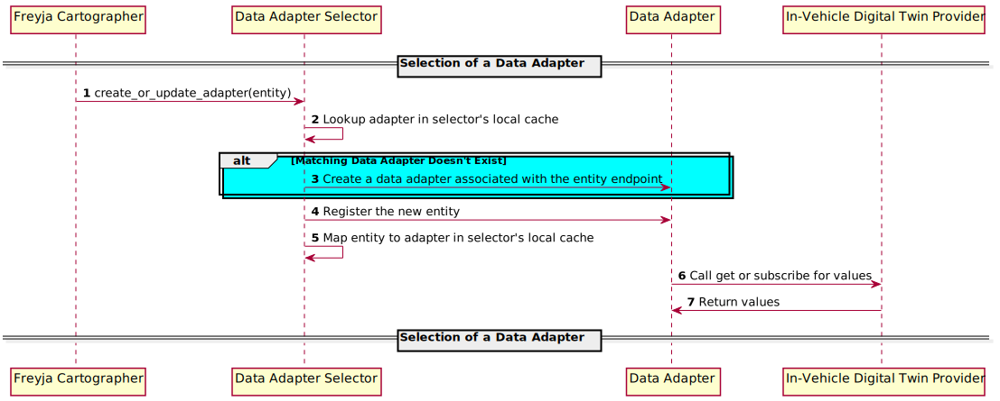

# Data Adapter Selector

The Data Adapter Selector enables communication with protocol-agnostic in-vehicle digital twin providers, such as MQTT, HTTP, or gRPC, by selecting the appropriate data adapter based on the protocol and operations it supports.

## Data Adapter Selection Sequence Diagram

## Sample Data Adapters

A data adapter retrieves values from a provider's entity. Compatibility with a digital twin provider requires the use of the same protocol and schema. Sample data adapters can be found in the [adapters/data](../adapters/data/) directory.

Data Adapter|Description|Usage
-|-|-
InMemoryMockDataAdapter|Contains its own provider and generates values for the provider's entities.|When the [InMemoryMockDigitalTwinAdapter](../adapters/digital_twin/in_memory_mock_digital_twin_adapter/) is configured.
GRPCDataAdapter|Handles making gRPC calls to Ibeji's providers that are using the [ibeji/samples/interfaces/sample_grpc/v1](https://github.com/eclipse-ibeji/ibeji/blob/main/samples/interfaces/sample_grpc/v1/digital_twin_provider.proto) protobuf file|When Ibeji integration with Freyja is configured and you're using a sample that communicates with GRPC.
HTTPMockDataAdapter|Handles making HTTP calls to the [MockDigitalTwin](../mocks/mock_digital_twin/) for values|When MockDigitalTwin integration with Freyja is configured.
MqttDataAdapter|Handles communication with providers that use MQTT|When Ibeji integration with Freyja is configured and you're using a sample that communicates with MQTT.
ManagedSubscribeDataAdapter|Handles communication with providers using the managed subscribe model defined by [Agemo](https://github.com/eclipse-chariott/agemo)|When Ibeji integration is configured and managed subscribe is enabled in Ibeji. Will also require other adapters when resolving the managed endpoint.
