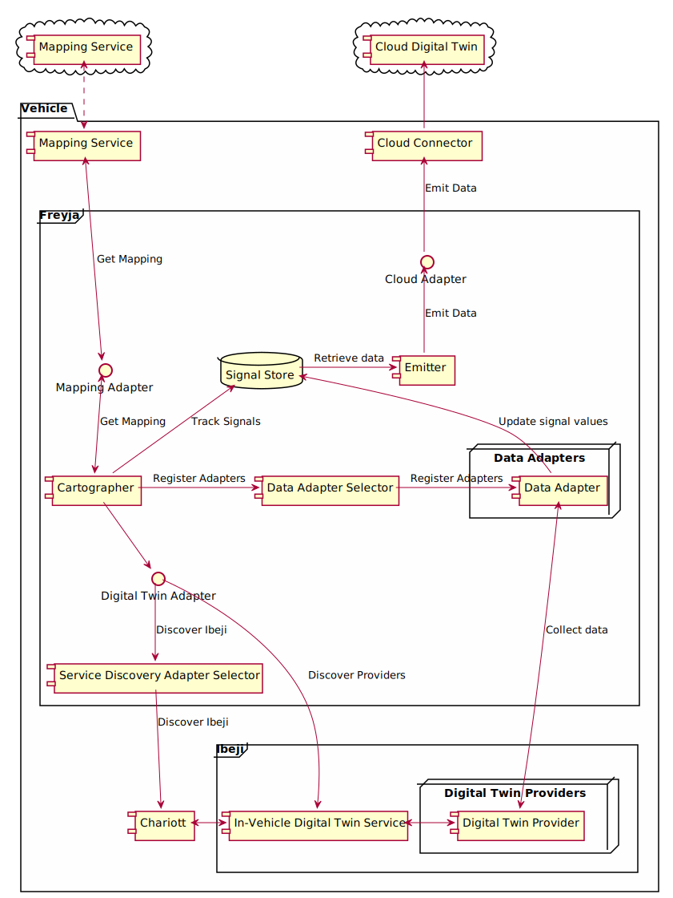
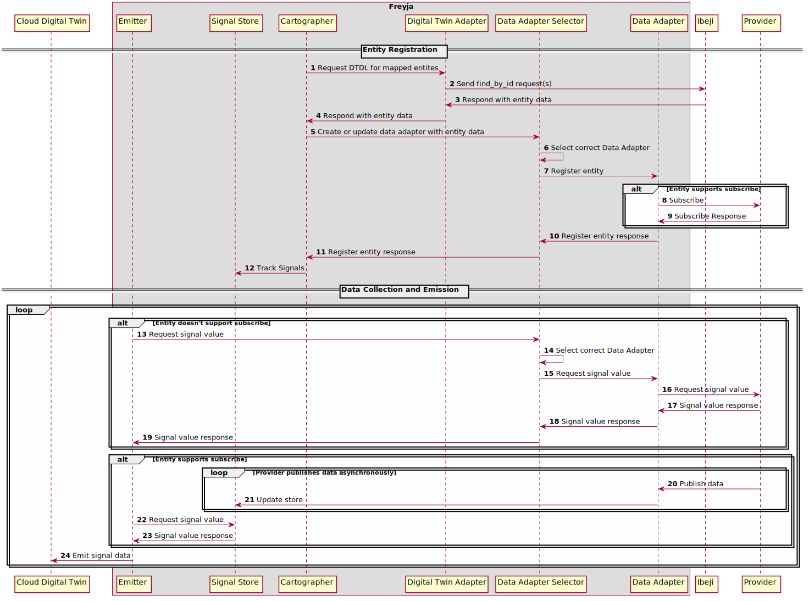
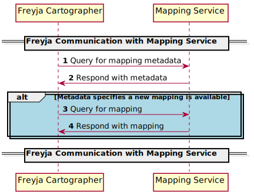
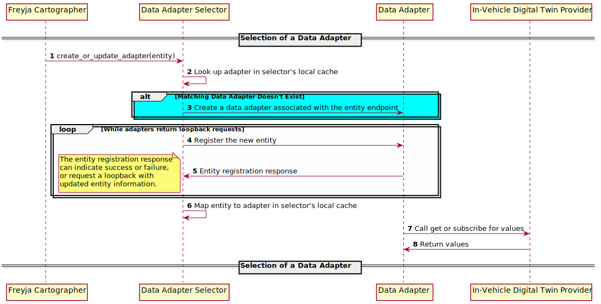

# Freyja Design Specification

- [Introduction](#introduction)
- [Architecture](#architecture)
  - [Cartographer](#cartographer)
  - [Emitter](#emitter)
  - [External Interfaces](#external-interfaces)
  - [Mapping Service](#mapping-service)
- [Future Work](#future-work)

## Introduction

The Software-Defined Vehicle will need to connect to the cloud for scenarios such as data synchronization, command processing, and analytics. However, this is a hard problem when different vehicles with different digital twin models need to synchronize on a shared "canonical model" in the cloud. The Freyja project solves this problem by creating a flexible framework for digital twin synchronization in the vehicle.

## Architecture

At its core, Freyja consists of the following primary components: the **cartographer**, the **emitter**, the **data adapter selector**, and the **signal store**. In addition to these core components, there are multiple interfaces with external components that define how Freyja interacts with the cloud and the rest of the Software Defined Vehicle. There are interfaces for the in-vehicle digital twin service (such as Ibeji), the mapping service (authored by users), the cloud digital twin provider (such as Azure or AWS), and the digital twin providers (authored by users). Below is a high-level diagram of the Freyja components:

In a typical life cycle, the Freyja application will start up, discover Ibeji via Chariott or a static configuration, then connect to the mapping service to obtain an entity map. This map will define which signals need to be synced with the cloud digital twin, how often they need to be synced, and how the data should be transformed or packaged. Once a mapping is obtained, Freyja will connect to the providers and begin emitting their data according to the mapping. In case of changes on either the device or vehicle side, the mapping is dynamic and can be updated as required to add, remove, or modify the signals that are being emitted.

The following is a more detailed diagram illustrating how the components interact and how a mapping results in signal data emissions:

### Cartographer

The cartographer is the core component responsible for managing the entity map and tracking which signals should be synchronized to the cloud.

The cartographer interfaces with the mapping adapter to poll the mapping service for updates. If there is an update pending, the cartographer will download it and interface with the digital twin adapter to look up the corresponding entity information. Then, the cartographer will use this information to register data adapters with the data adapter selector. Finally, the cartographer will populate the signal store with the signals that should be tracked. If any part of this process fails for a given entity, the cartographer will retry again at a later time.

The following diagram illustrates the communication between the cartographer and the mapping service:

### Emitter

The emitter is the core component responsible for actually emitting data. The emitter interfaces with the signal store to determine which signals should be emitted. The signal store is considered to be the source of truth for this information, and every signal present in the store is a signal that will be emitted.

The emitter supports intervals at a per-signal level to enable signals to have different requirements on how often they are synced with the cloud. Note that once a signal is added to the mapping and picked up by the cartographer, it can take up to `min(`*`I`*`)` before the signal is emitted, where *`I`* is the set of intervals for signals already being tracked.

### Data Adapter Selector

The data adapter selector is the core component responsible for managing communication with data adapters. It behaves like a gateway service and allows callers to interact with the correct data adapter for a given entity.

The data adapter selector's main interface is the `create_or_update_adapter` function, which accepts an entity description as an argument. When calling this function, the data adapter selector will first use the entity's endpoint URI to search for an existing adapter that can handle the requested entity. If no such adapter is found, the entity's protocol and operation are used to search for an adapter type that can handle that entity, and then an adapter is created. In either case, the new entity is registered with the adapter, which then interfaces with that entity's endpoint to obtain data.

The data adapter selector also supports a "loopback" functionality. When registering an entity with an adapter, the adapter may return a request for a loopback with updated entity info. This indicates to the selector that the matched adapter cannot handle the originally requested entity, but has modified its contents to redirect it to another adapter. This enables scenarios such as managed subscribe to perform pre-processing on entities and recycle other existing data adapters. For more information on the managed subscribe functionality, see the [Eclipse Agemo project](https://github.com/eclipse-chariott/agemo).

Below is a sequence diagram illustrating the data adapter selection process:

### External Interfaces

Freyja has the following interfaces for external components:

Component|Examples|Interface Trait|Description
-|-|-|-
In-Vehicle Digital Twin|Ibeji and its providers|`DigitalTwinAdapter`|Communicates with the in-vehicle digital twin to get signal values during emission. Often referred to as "DT Adapter"
Mapping Service|`MockMappingService`, other customer-provided implementations|`MappingAdapter`|Communicates with the mapping service
Cloud Digital Twin|Azure, AWS|`CloudAdapter`|Communicates with the cloud digital twin provider

All of these interfaces are defined as traits with async functions in the `contracts/src` folder.

#### In-Vehicle Digital Twin Interface

The digital twin adapter interfaces with a digital twin service to get entity information. The [Ibeji Project](https://github.com/eclipse-ibeji/ibeji) is an example of such a service. This interface requires the following function implementations:

- `create_new`: Serves as an integration point for the core Freyja components. This function will be called by the `freyja_main` function to create an instance of your adapter.
- `find_by_id`: Queries the digital twin service for information about the requested entity. This information will later be used to set up a communication pipeline with that entity's provider.

Although this component is built with the same pluggable model as other external interfaces, it is being designed closely together with other SDV components. As a result, it is strongly suggested to use the provided SDV implementation of this interface, and this implementation should be sufficient for most production scenarios.

#### Mapping Adapter Interface

Freyja communicates with a mapping service via the `MappingAdapter` trait to get information about how to package data during emission. This trait defines the following functions:

- `create_new`: Serves as an integration point for the core Freyja components. This function will be called by the `freyja_main` function to create an instance of your adapter.
- `check_for_work`: Because mappings returned from the `get_mapping` API can potentially be large, this method is used to first poll for changes before calling that API. If the result is false, then the cartographer will not invoke the `get_mapping` API until it polls again.
- `send_inventory`: This API is currently unused. It is reserved for potential future use, but may also be removed. A default empty implementation is provided for convenience so that this function may be omitted from your trait implementation. It is also safe to use the `unimplemented!()` macro since this function will not be called.
- `get_mapping`: Returns mapping information that will be used by Freyja's emitter

For more information about the mapping service and how this interface is used, see the [Mapping Service](#mapping-service) section.

#### Cloud Digital Twin Interface

The cloud adapter interfaces with the cloud or a cloud connector to emit data to a digital twin. It's recommended to route communication through a cloud connector on the device to help manage authentication, batching, and other policies that may be useful for automotive scenarios. This interface requires the following function implementations:

- `create_new`: Serves as an integration point for the core Freyja components. This function will be called by the `freyja_main` function to create an instance of your adapter.
- `send_to_cloud`: Sends data to the cloud or cloud connector. The request includes a `cloud_signal` property which is a hash map of custom key-value arguments, and the signal value will be converted to a string.

### Mapping Service

Freyja relies on an external mapping service to define how data should be synced to the cloud. The implementation of this service is intentionally left undefined as it's expected that it will vary on a per-customer basis. We only define the interface that the Freyja application expects and provide some sample mock services.

At a high level, this component should be able to identify the vehicle making a request and either look up or compute a mapping for that vehicle. This could be done with a static vehicle-id-to-mapping database, or it might be more dynamic and linked to the cloud digital twin solution to compute mappings on the fly.

The reference architecture here specifies the mapping service as a cloud service with which Freyja communicates, though an alternate reference architecture may have Freyja communicating with another application on the vehicle which caches data from the cloud service. Yet another potential architecture may leverage the vehicle's OTA solution to update the mapping data on a local mapping service rather than having a dedicated cloud mapping service. Freyja supports a flexible pluggable system to enable customers to select the implementation that best meets their needs.

## Future Work

Freyja currently only supports device-to-cloud (D2C) scenarios. Cloud-to-device (C2D) scenarios are planned for the future, though there are no current designs for this feature.

In addition, Freyja currently only supports a built-in set of protocols and data schemas for communication with providers. In the future, this will have a pluggable model similar to other adapters to enable custom protocols.
