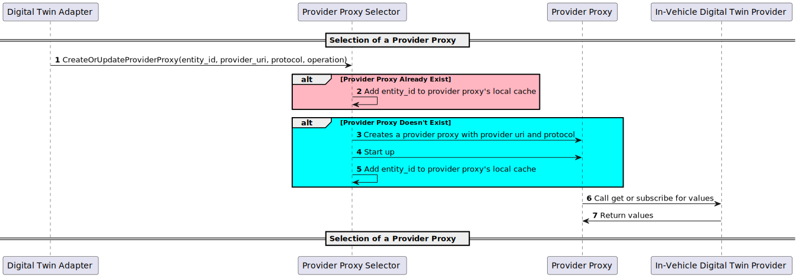

# Provider Proxy Selector

The Provider Proxy Selector enables communication with protocol-agnostic in-vehicle digital twin providers, such as MQTT, HTTP, or gRPC, by selecting the appropriate provider proxy based on the protocol and operations it supports.

## Provider Proxy Selection Sequence Diagram

## Sample Provider Proxies

A provider proxy retrieves values from a provider's entity. Compatibility with a digital twin provider requires the use of the same protocol and schema. Sample provider proxies can be found in the [../provider_proxies](../provider_proxies/) directory.

Provider Proxy|Description|Usage
-|-|-
InMemoryMockProviderProxy|Contains its own provider and generates values for the provider's entities.|When the [InMemoryMockDigitalTwinAdapter](../digital_twin_adapters/in_memory_mock_digital_twin_adapter/) is configured.
GRPCProviderProxy|Handles making gRPC calls to Ibeji's providers that are using the [ibeji/samples/interfaces/sample_grpc/v1](https://github.com/eclipse-ibeji/ibeji/blob/main/samples/interfaces/sample_grpc/v1/digital_twin_provider.proto) protobuf file|When Ibeji integration with Freyja is configured.
HTTPMockProviderProxy|Handles making HTTP calls to the [MockDigitalTwin](../mocks/mock_digital_twin/) for values|When MockDigitalTwin integration with Freyja is configured
